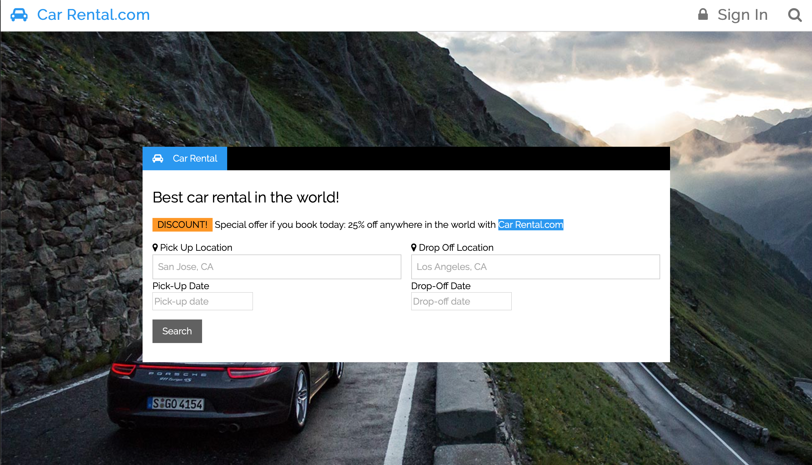
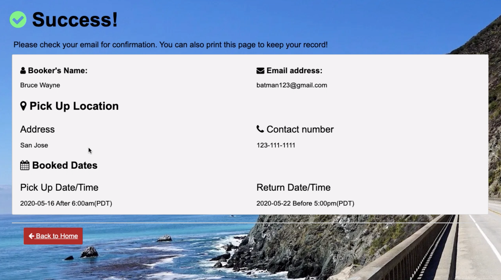

# Project-CarRental -- CMPE 172 Group Project
:star: Star us on GitHub!

## Table of Content
- [Project Overview](#project-overview)
  - [Welcome Page](#welcome-page)
  - [Search/home Page](#searchhome-page)
  - [Confirm Page](#confirm-page)
- [Setup Localhost](#setup-localhost)
- [Team Members & Contribution](#team-members--contribution)

## Project Overview
**CarRental.com** is a simplecar rental system. Our goal is to simplify the process of renting cars.

### Welcome Page


The car rental platform has become an exciting startup option and has a place in the world. Users who want to rent a car can search for the car according to their needs and rent the car after providing the necessary details and payment. The goal of our project is that the process of registering a "car rental" takes only a few seconds. The user only needs to fill in personal information and select a car(s) to fulfill the entire process.

### Search/home Page


### Confirm Page



## Setup Localhost

- Clone this repo on your terminal, using command:
```terminal
git clone https://github.com/SharonShih/Project-CarRental.git
```
- Open file and go to file `application.properties`
> File Directory: `Project-CarRental/demo_car_rental/src/main/resources/application.properties`

- Change the following info to your local MySQL username & password
```html
spring.datasource.username= <your username>
spring.datasource.password= <your password>
```
- If there's any time zone issue, add `?useLegacyDatetimeCode=false&serverTimezone=UTC` at end of the jdbc url
```
spring.datasource.url=jdbc:mysql://localhost:3306/Car?useLegacyDatetimeCode=false&serverTimezone=UTC
```
- Make sure you have a Schema name `Car` under your database
- Run the Spring boot file `DemoCarRentalApplication` using Maven (import Pom.xml in your IDE)
- After Spring boot running successfully, go to the server port(on the `application.properties`)
- Typically, it's `9234`. Go to the first page:
```http
localhost:9234/welcome
```

## Team Members & Contribution
[Dylan Zhang](https://github.com/ddyy814) | [En-Ping Shih](https://github.com/SharonShih) | [Tsz Hin Chan](https://github.com/TszHin0)
------------|-------------|-----------
Spring boot, RDS, Docker, PPT | HTML/CSS, Project Report, Demo Video, README.md| Spring boot, EC2, HTML(ThymeLeaf), Docker

